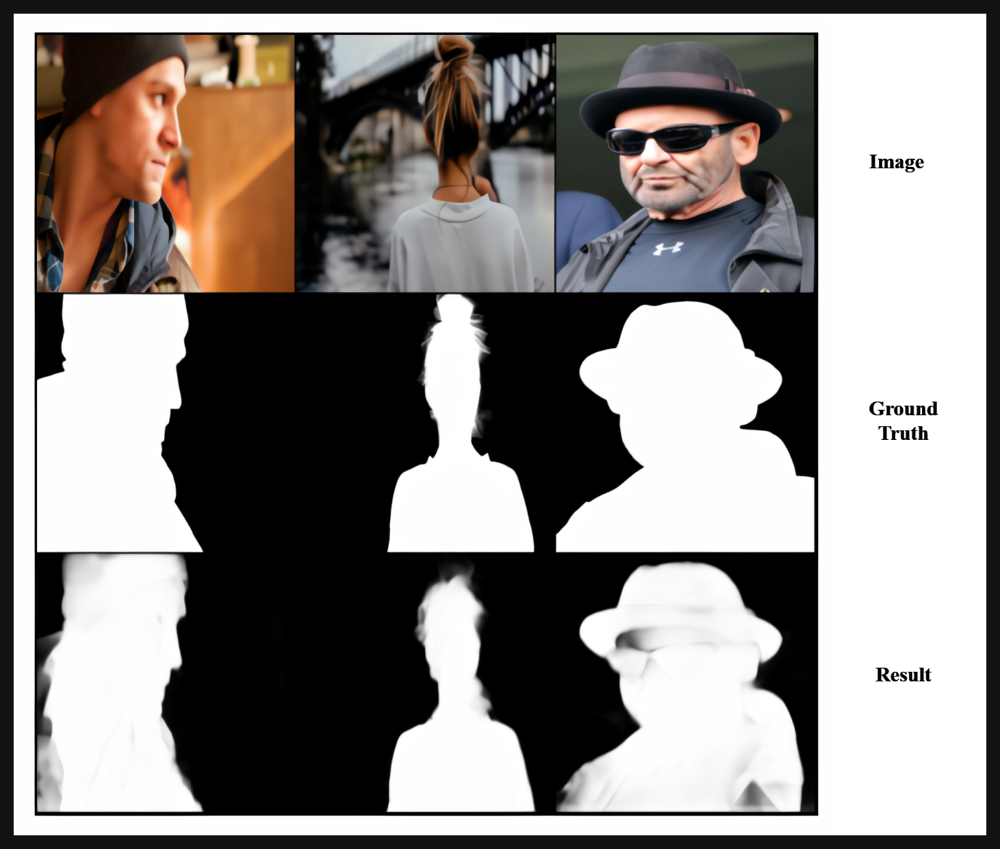

# U2 NET

 
<figcaption><i>Fig.1 - U2Net Architecture</i></figcaption>

* **U2-Net** is a two-level nested U-structure architecture. It uses a novel ReSidual U-block (RSU) module to extract multi-scale features without degrading resolution, allowing the network to go deeper and attain high resolution without significantly increasing memory and computation cost.
* used for for salient object detection, image segmentation, and other image2image modeling tasks.

 
<figcaption><i>Fig.2 - UNet or RSU Block</i></figcaption>

* U-Net is a U-shaped encoder-decoder architecture with residual connections between each layers. It captures contextual information and intricate detail.
* These U-Net blocks in U2Net architecture are called ReSidual U-block or RSU.

*  Example: we have trained an image segmentation model on [P3M-10k](https://paperswithcode.com/dataset/p3m-10k) dataset, and the results are given below.

 
<figcaption><i>Fig.3 - image segmentation with U2-Net example</i></figcaption>

 
